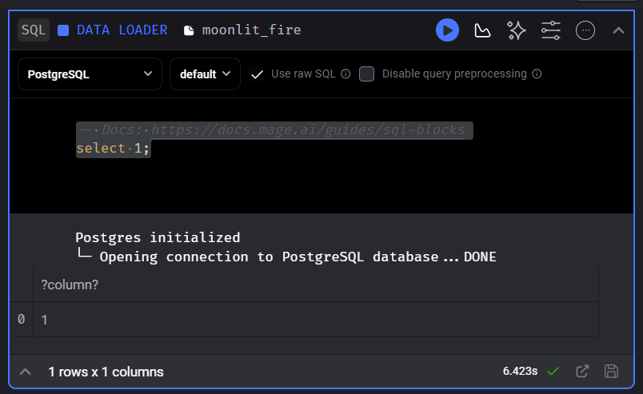

# magetalk

## demo steps

- [ ] local postgres running  
- [ ] connect pgadmin to local postgres (for host use ip `hostname -I`)
- [ ] files in google storage (maybe upload to github instead for an elt pipelin)
- [ ] load: load file and assert is not null
- [ ] transform: use a datascratch to show df.info(), remove null rows, create is delayed flag, create is overbooked flag
- [ ] export: dump to local postgres

### alternatively

- [ ] extract from api (github)
- [ ] dump to gcs
- [ ] transform - same
- [ ] export to postgres


## prerequisites

### install docker
use this [link](https://docs.docker.com/engine/install/)

### install docker-compose
```shell
wget https://github.com/docker/compose/releases/download/v2.24.3/docker-compose-linux-x86_64 
mkdir bin
mv docker-compose-linux-x86_64 bin/docker-compose && cd bin
chmod +x docker-compose 
echo -e "\nexport PATH=${HOME}/bin:/${PATH}" | tee -a .bashrc 
which docker-compose 
```

### install postgres
use this [link](https://www.postgresqltutorial.com/postgresql-getting-started/install-postgresql-linux/)

### docker command to run pgadmin
```shell
docker pull dpage/pgadmin4  
docker run -p 8080:80 \
-e 'PGADMIN_DEFAULT_EMAIL=user@domain.com' \
-e 'PGADMIN_DEFAULT_PASSWORD=SuperSecret' \
-e 'WTF_CSRF_CHECK_DEFAULT=False' \
-d dpage/pgadmin4  
docker container kill [container id]
```

### mage quickstart with docker-compose
use this [link](https://github.com/mage-ai/compose-quickstart)

#### important files:
- Dockerfile
- docker-compose.yml
- .env 
- requirements.txt


### setting up google cloud in mage
- add gc keyfile as volume to docker-compose.yml
  ```yaml
  - ~/.gcp/gcp-key.json:/home/src/gcp-key.json
  ```
- point to local json keyfile in io_config
  ```yaml
  GOOGLE_SERVICE_ACC_KEY_FILEPATH: "/home/src/gcp-key.json"
  ```

### setting up postgres in mage  
- update postgres connection settings in io_config.yaml 
```yaml
POSTGRES_CONNECT_TIMEOUT: 10
POSTGRES_DBNAME: postgres
POSTGRES_SCHEMA: public # Optional
POSTGRES_USER: postgres
POSTGRES_PASSWORD: postgres
POSTGRES_HOST: hostname # Replace hostname with IP 
POSTGRES_PORT: 5432
```
- test connection using a sql data loader


### data loader
- make sure to use raw.github file links

### explore in scratchpad
- look for nulls
```python
df.info() # remove nulls typecase
```
- look for overbooked flights
```python
df[['num_of_seats', 'booked_passengers', 'travelled_passengers']].head(100) # create is_overbooked flag
```
- look for delayed flights
```python
df[['scheduled_takeoff_datetime', 'actual_takeoff_datetime']].head(100) # create is_delayed flag
```

### transformer
- type cast
```python
    # type case
    data_types = {
        'flight_id': 'str',
        'airline': 'str',
        'start': 'str',
        'destination': 'str',
        'num_of_seats': 'Int64',
        'booked_passengers': 'Int64',
        'travelled_passengers': 'Int64',
        'scheduled_takeoff_datetime': 'datetime64', 
        'actual_takeoff_datetime': 'datetime64',
        'landing_datetime': 'datetime64'
    }
    data = data.astype(data_types)
```

- create is_overbooked flag
```python
    # create is_overbooked flag
    data['is_overbooked'] = (data['booked_passengers'] > data['num_of_seats']).astype(int)
```

- create is_delayed flag
```python
    # create is_delayed flag
    data['is_delayed'] = (data['actual_takeoff_datetime'] > data['scheduled_takeoff_datetime']).astype(int)
```

- attest the following:
```python
@test 
def test_airline(output, *args) -> None:
    assert output['airline'].isnull().sum()==0, 'airline value exists for all records'

@test
def test_passenger_count(output, *args) -> None:
    assert output['travelled_passengers'].isin([0]).sum()==0, 'passenger count is greater than 0'

@test 
def test_start_end(output, *args) -> None:
    assert (output['start'] == output['destination']).sum()==0, 'start and destination always differ'

@test
def test_output(output, *args) -> None:
    """
    Template code for testing the output of the block.
    """
    assert output is not None, 'The output is undefined'
```

### data exporter
- load to postgres, and set if_exists = 'merge'